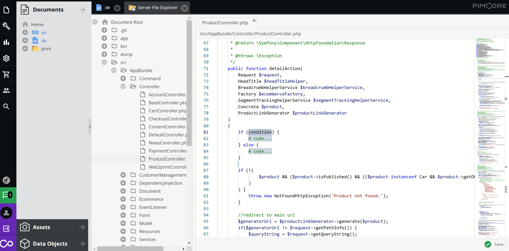
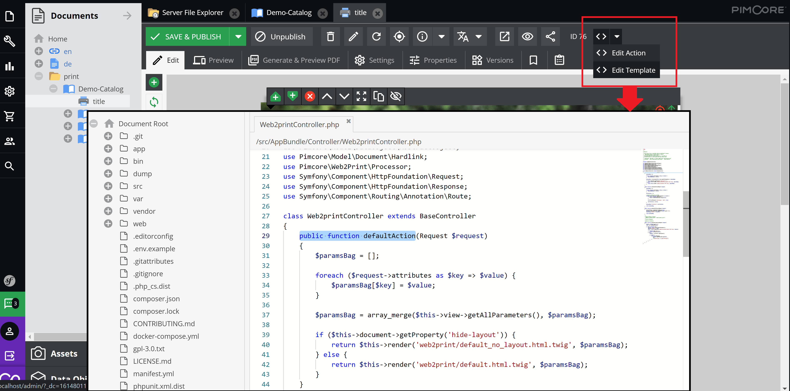
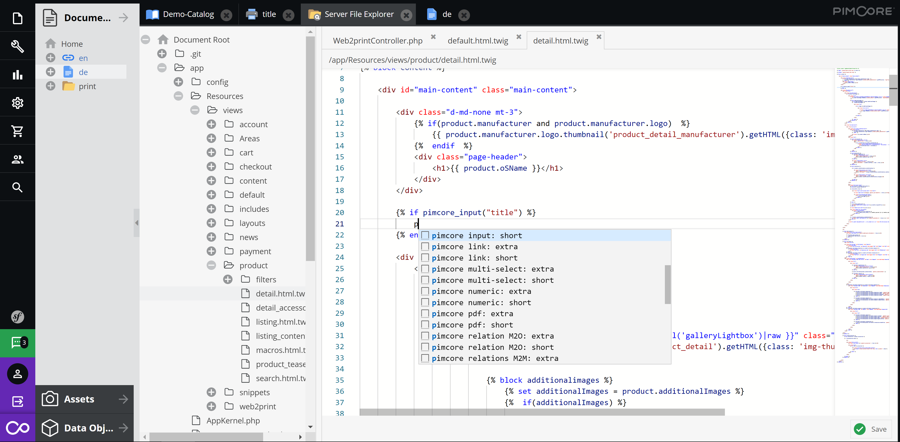

# pimcore-code-editor-bundle

Edit PHP, Twig, JS, CSS code from within the Pimcore admin page.

## Installation

#### Install with composer

```bash
composer require hamari-agency/pimcore-code-editor-bundle
```

#### Enable HamariCodeEditorBundle bundle

```bash
bin/console pimcore:bundle:enable HamariCodeEditorBundle
```

#### Features

Edit server files:



Jump to Controller Actions and Template code directly from the Documents page:



Includes Pimcore twig snippets for fast code editing:

